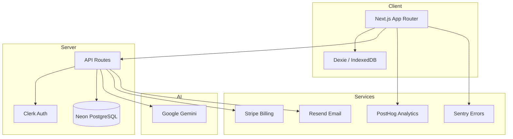

<div align="center">


# Zagafy

**Your antiquarian narrative workshop.**

A continuity-aware writing application that helps authors craft consistent, deep stories with AI-powered story intelligence.

[Features](#features) · [Quick Start](#quick-start) · [Architecture](#architecture) · [Deploy](#deploy) · [Contributing](#contributing)

</div>

---

## Features

- **Manuscript Editor** — Write chapters with live word count and auto-save
- **Genesis Wizard** — Build your story's foundation in 6 guided steps
- **Flow Mode** — Distraction-free deep writing with micro-prompts
- **AI Copilot** — Context-aware writing assistant that respects your canon
- **Story Brain** — Automatic consistency checking across characters, timeline, and world
- **Canon System** — Lock confirmed story facts to prevent contradictions
- **Character Chat** — Interview your characters in 3 modes (exploration, scene, confrontation)
- **Heteronyms** — Write in different voices with AI-aware writing personas
- **Story Bible** — Central reference for world rules, locations, themes
- **Publishing Pipeline** — Query letter generator, synopsis builder, submission tracker
- **Cloud Sync** — Sync stories across devices (optional, via Clerk)
- **Export** — JSON story bible export, manuscript export

## Quick Start

### Prerequisites

- Node.js ≥ 20
- A [Google AI Studio](https://aistudio.google.com/) API key (Gemini)

### Setup

```bash
git clone https://github.com/PJose15/story-memory-writer.git
cd story-memory-writer
npm install
cp .env.example .env.local
# Edit .env.local and add your GEMINI_API_KEY
npm run dev
```

Open [http://localhost:3000](http://localhost:3000) and start with the Genesis wizard.

### Environment Variables

| Variable | Required | Description |
|----------|----------|-------------|
| `GEMINI_API_KEY` | Yes | Google Gemini API key |
| `CLERK_SECRET_KEY` | No | Clerk auth (SaaS mode) |
| `NEXT_PUBLIC_CLERK_PUBLISHABLE_KEY` | No | Clerk public key |
| `DATABASE_URL` | No | Neon PostgreSQL (cloud sync) |
| `STRIPE_SECRET_KEY` | No | Stripe billing |
| `SENTRY_DSN` | No | Error tracking |
| `NEXT_PUBLIC_POSTHOG_KEY` | No | Analytics |

## Architecture



### Key Directories

```
app/                  # Next.js App Router pages
  api/                # Server-side API endpoints (14 routes)
  (auth)/             # Clerk sign-in/sign-up
  (marketing)/        # Marketing site (home, features, pricing)
  genesis/            # Story creation wizard
components/
  antiquarian/        # Design system (parchment, brass, sepia)
lib/
  prompts/            # AI system prompts (6 files)
  types/              # TypeScript type definitions
  storage/            # Dexie (IndexedDB) persistence
  sync/               # Cloud sync engine
  ai/                 # AI response parsing, retry, validation
  gamification/       # Streaks, XP, leveling
e2e/                  # Playwright E2E tests
loadtest/             # k6 load tests
eval/                 # AI quality eval pipeline
docs/                 # Project documentation
```

### AI Endpoints

| Route | Purpose |
|-------|---------|
| `/api/chat` | Writing assistant (multi-turn, canon-aware) |
| `/api/character-chat` | Character interview (3 modes) |
| `/api/story-coach` | Scene analysis (6 lenses) |
| `/api/audit` | Consistency audit |
| `/api/micro-prompt` | Flow mode next-sentence prompts |
| `/api/polish` | Prose refinement |
| `/api/analyze-character` | Character depth analysis |
| `/api/extract-world-bible` | Extract world data from text |
| `/api/ingest` | File import + AI extraction |
| `/api/closing-question` | Session-end reflection |

## Testing

```bash
npm run test              # Unit tests (Vitest)
npm run test:coverage     # With coverage
npm run test:e2e          # E2E tests (Playwright)
npx tsx eval/runner.ts    # AI quality eval
```

## Deploy

### Vercel (recommended)

1. Push to GitHub
2. Import in [Vercel](https://vercel.com)
3. Set environment variables
4. Deploy

### Staging

See [docs/STAGING.md](docs/STAGING.md) for the staging environment setup.

## Documentation

- [SECURITY.md](docs/SECURITY.md) — Security model and threat analysis
- [ACCESSIBILITY.md](docs/ACCESSIBILITY.md) — WCAG 2.2 AA compliance
- [HETERONYMS.md](docs/HETERONYMS.md) — Heteronym system guide
- [DEPENDENCIES.md](docs/DEPENDENCIES.md) — Dependency management policy
- [STAGING.md](docs/STAGING.md) — Staging environment
- [ROADMAP.md](docs/ROADMAP.md) — Feature roadmap

## Contributing

1. Fork the repository
2. Create a feature branch (`git checkout -b feature/amazing-feature`)
3. Commit your changes
4. Push to the branch (`git push origin feature/amazing-feature`)
5. Open a Pull Request

## License

This project is proprietary. All rights reserved.
